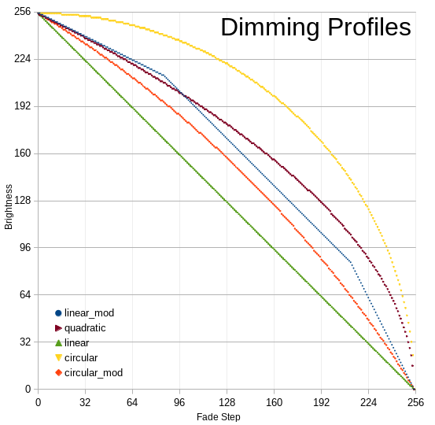

# tree
Code for a blinky palm tree. Check out [avr-libc] (https://nongnu.org/avr-libc/)
for the libs I use.

# dimming profiles
I decided I didn't like a strictly linear dim, so I played around with some
custom dimming profiles, implemented as a lookup table. Turns out, it starts
looking weird if you stray too far from linear, so I settled on the
circular_mod profile. This is, of course, for my sister, so if she doesn't like
it I'll keep tweaking! See the ODS spreadsheet for calculation details.
Remember, since we're using inverted PWM, an output of 255 is off and 0 is
fully on.

